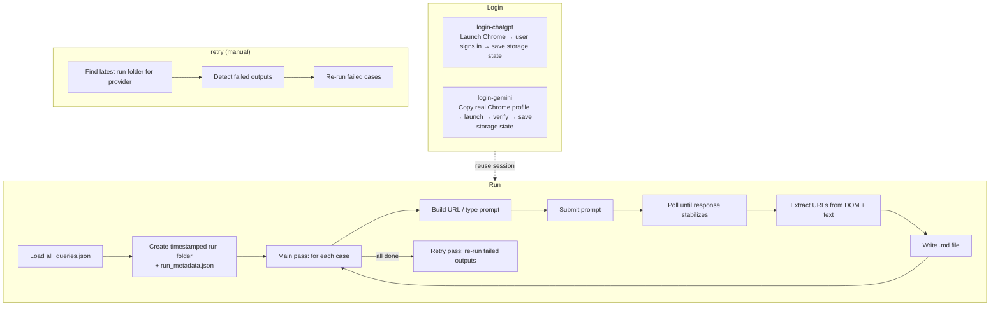
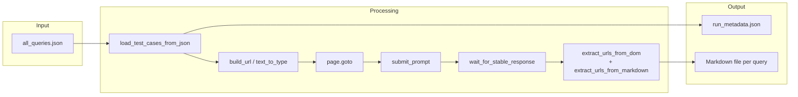
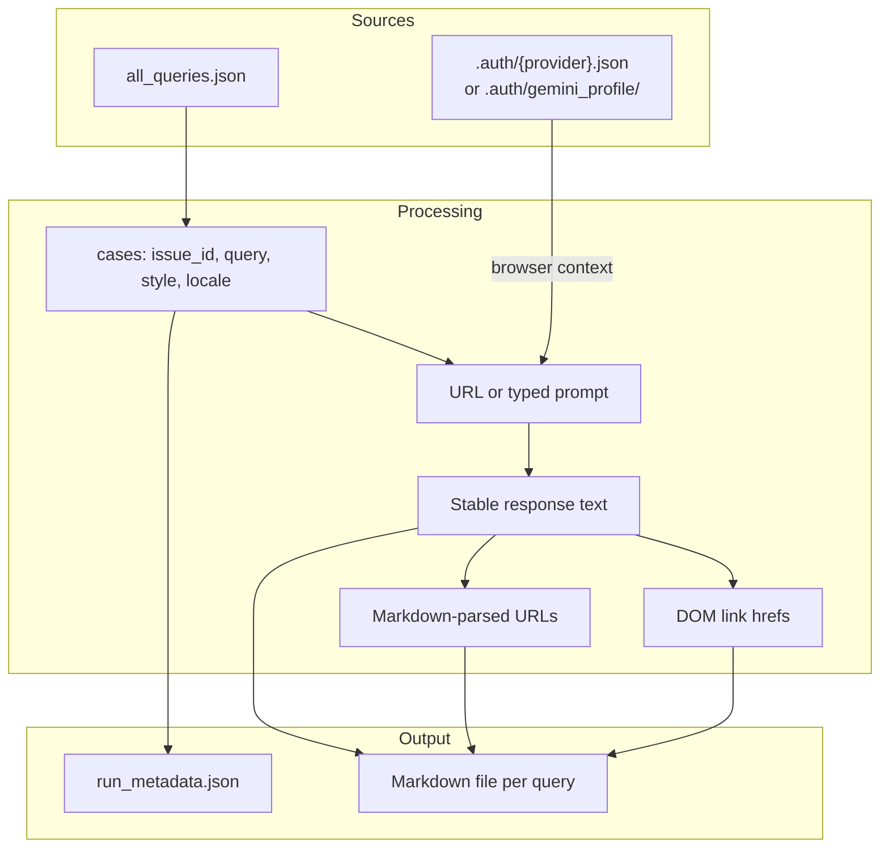

# LLM Runner Script — How It Works

Technical description of `llm_runner.py`: architecture, data flow, and main components.

---

## Purpose

The script automates running localized External LLM queries (ChatGPT, Gemini) against their web UIs, capturing responses and saving them in markdown for evaluation.

---

## Commands Overview

| Command | Role |
|---------|------|
| `login-chatgpt` | Record ChatGPT session (one-time) |
| `login-gemini` | Copy Google session from real Chrome profile (one-time) |
| `run` | Execute queries, extract responses and links, write markdown |
| `retry` | Retry failed outputs from the latest (or a specified) run |

---

## High-Level Flow

---

## Run Command — Detailed Flow

---

## Component Responsibilities

### 1. Authentication

| Function | Role |
|----------|------|
| `cmd_login()` | Launch browser, wait for manual login, save `context.storage_state()` |
| `_real_chrome_user_data_dir()` | Locate the OS Chrome User Data directory |
| `_copy_chrome_auth_files()` | Copy minimal Google session files to `.auth/gemini_profile/` so Playwright can use a non-default profile dir (Chrome blocks CDP on its default dir) |
| `_open_browser_context()` | Shared helper: opens persistent context (Gemini) or ephemeral context with storage state (ChatGPT) |

**Why two approaches?**  
ChatGPT uses a plain storage state JSON (cookies + localStorage). Google blocks sign-in in fresh browser contexts even with anti-detection flags, so Gemini uses a persistent Chrome profile copied from the real user data directory.

### 2. Input Loading

| Function | Role |
|----------|------|
| `load_test_cases_from_json()` | Read `all_queries.json`; filter by locale; return `[{issue_id, query, query_style, query_locale}]` |
| `parse_locale_filter()` | Accept `en`, `pt`, `es`, comma-separated, or `all` |

### 3. Prompt Building

| Function | Role |
|----------|------|
| `build_url()` | **ChatGPT**: URL-encode `query + web-search suffix` into `?q=`. **Gemini**: returns base URL only (prompt is typed directly). |
| `WEB_SEARCH_SUFFIX` | Localized instruction appended to every prompt: `"Search the web."` / `"Pesquise na web."` / `"Busca en la web."` |

### 4. Prompt Submission

| Function | Role |
|----------|------|
| `submit_prompt()` | Focus the composer textarea, optionally type the prompt (Gemini), click Send button or fall back to `Enter` |

**ChatGPT**: prompt is pre-filled via `?q=`; only submission is needed.  
**Gemini**: navigates to the base URL and types the full prompt directly into the composer to avoid the need for a browser extension.

### 5. Response Extraction

| Function | Role |
|----------|------|
| `wait_for_stable_response()` | Polls provider-specific DOM selectors every 2 seconds; returns text once it has been unchanged for 5 seconds. Never uses `networkidle` (streaming UIs never reach it). Only targets specific response selectors — never broad fallbacks like `main` — to avoid capturing page chrome before the answer loads. |

### 6. URL Extraction

| Function | Role |
|----------|------|
| `extract_urls_from_markdown()` | Parse `[text](url)` and bare `https?://` links from response text |
| `extract_urls_from_dom()` | **ChatGPT**: query `<a href>` inside the response element (citations are inline DOM links not present in `inner_text()`). **Gemini**: query `body a[href]` (sources appear in a separate panel outside the response container). |

URLs are not filtered at extraction time; filtering can be applied during analysis.

### 7. Output

| Artifact | Description |
|----------|-------------|
| `run_metadata.json` | Written at run start; updated at end with `ended_at`, `completed`, `skipped`, `errors`, `retried` |
| `{Provider}-{Style}-{locale}_{issue_id}.md` | One file per query: metadata, prompt, response text, extracted URLs |

### 8. Retry

| Function | Role |
|----------|------|
| `_is_failed_output()` | Returns `True` if output has `(empty)` response, `[Error:` response, or `- (none)` URLs |
| `_find_failed_cases()` | Cross-references cases list with output files; deletes failed files and returns their cases |
| `_run_query_loop()` | Shared loop used by both main pass and retry pass |
| `cmd_retry()` | Standalone `retry` command: finds latest run folder, detects failures, re-runs them |

The automatic retry runs immediately after the main pass within the same `run` invocation. The `retry` command allows re-triggering it manually on any existing run folder.

---

## Data Flow (Run)

---

## Design Decisions

| Decision | Rationale |
|----------|-----------|
| **Persistent Chrome profile for Gemini** | Google blocks sign-in and automation in fresh browser contexts; copying the real profile bypasses detection |
| **Stable-response polling instead of `networkidle`** | Streaming UIs (ChatGPT, Gemini) never reach networkidle; polling until text stops changing is reliable |
| **Prompt typed directly into Gemini composer** | Removes dependency on a browser extension for `?prompt=` URL support |
| **Localized web search suffix in prompt** | Explicitly instructs the LLM to search the web, producing grounded responses with source links |
| **DOM link extraction** | `inner_text()` strips HTML; citation link buttons are only accessible via `<a href>` in the DOM |
| **Separate DOM scan scope per provider** | ChatGPT citations are inline in the response element; Gemini sources are in a separate page panel |
| **Per-run timestamped folders** | Isolates runs; allows comparing runs over time without overwriting |
| **Skip existing output files** | Allows resuming interrupted runs |
| **Automatic + manual retry** | Catches transient failures (timeouts, missed responses) without requiring a full re-run |
| **One file per query** | Simplifies aggregation, diffing, and integration with evaluation scripts |
